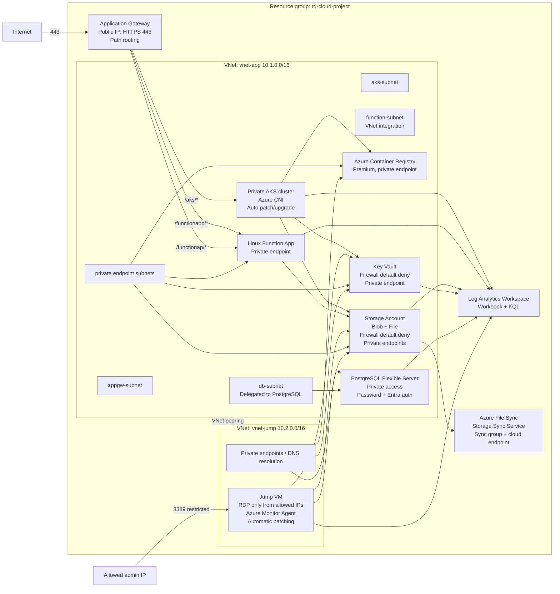

# Azure Cloud Project Architecture

```mermaid
flowchart LR
    internet["Internet"]
    admin["Allowed admin IP"]

    subgraph rg["Resource group: rg-cloud-project"]
        appgw["Application Gateway\nPublic IP: HTTPS 443\nPath routing"]
        law["Log Analytics Workspace\nWorkbook + KQL"]

        subgraph appvnet["VNet: vnet-app 10.1.0.0/16"]
            agwsub["appgw-subnet"]
            akssub["aks-subnet"]
            funcsub["function-subnet\nVNet integration"]
            dbsub["db-subnet\nDelegated to PostgreSQL"]
            pesub["private endpoint subnets"]

            aks["Private AKS cluster\nAzure CNI\nAuto patch/upgrade"]
            func["Linux Function App\nPrivate endpoint"]
            acr["Azure Container Registry\nPremium, private endpoint"]
            kv["Key Vault\nFirewall default deny\nPrivate endpoint"]
            storage["Storage Account\nBlob + File\nFirewall default deny\nPrivate endpoints"]
            psql["PostgreSQL Flexible Server\nPrivate access\nPassword + Entra auth"]
        end

        subgraph jumpvnet["VNet: vnet-jump 10.2.0.0/16"]
            jump["Jump VM\nRDP only from allowed IPs\nAzure Monitor Agent\nAutomatic patching"]
            jumppe["Private endpoints / DNS resolution"]
        end

        filesync["Azure File Sync\nStorage Sync Service\nSync group + cloud endpoint"]
    end

    internet -->|443| appgw
    admin -->|3389 restricted| jump

    appgw -->|/aks/*| aks
    appgw -->|/functionapp/*| func
    appgw -->|/functionap/*| func

    aks --> acr
    aks --> kv
    aks --> storage
    func --> storage
    jump --> storage
    jump --> kv
    jump --> psql

    storage --> filesync
    aks --> law
    func --> law
    storage --> law
    kv --> law
    psql --> law
    jump --> law

    appvnet <-->|VNet peering| jumpvnet
    pesub --> acr
    pesub --> kv
    pesub --> storage
    pesub --> func
    dbsub --> psql
    jumppe --> storage
    jumppe --> kv
    jumppe --> acr
```
